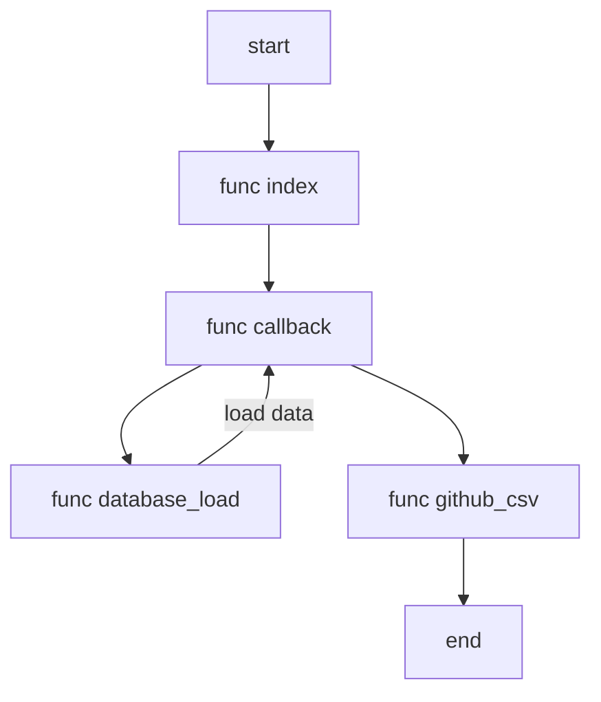

[](https://classroom.github.com/a/U95dUAR4)
[](https://classroom.github.com/online_ide?assignment_repo_id=10878762&assignment_repo_type=AssignmentRepo)<br />
<br />
Clone the repository:
```
git clone (repository URL)
```
or download as .zip file
Before running the files, activate virtual environment according to your operating system and install all the project dependencies using the 'requirements.txt' file:
```
pip install -r requirements.txt
```
Register your OAuth app to generate a client id and client secret using Github Developer Settings.

Create a .env file and intialise CLIENT_ID, CLIENT_SECRET, REDIRECT_URI, DATABASE_HOST, DATABASE_USERNAME, DATABASE_PASSWORD, DATABASE_NAME according to your requirements.
To run the flask app, open terminal and execute the following commands:
- On Linux/OSX via the terminal:

  ```Shell
    export FLASK_APP=app.py
    export FLASK_ENV=development
    export FLASK_DEBUG=1
    export FLASK_RUN_CERT=adhoc
    flask run
  ```

- On Windows:

  ```PowerShell
    $env:FLASK_APP="app1.py"
    $env:FLASK_ENV="development"
    $env:FLASK_DEBUG="1"
    $env:FLASK_RUN_CERT="adhoc"
    flask run
  ```

To run 'app1.py', type the below command in the terminal:
```
$python3 app1.py
```
Go to the browser and run the Homepage URL along with the endpoint specified, for example:
```
http://127.0.0.1:5000/
```
Finally, the CSV file is downloaded automatically by reaching the required endpoint.

Simple Diagrammatic Representation:

